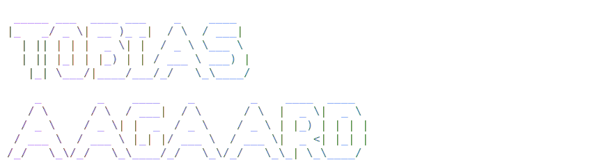

  

  <h3>Let's Connect!</h3>

  <a href="https://www.linkedin.com/in/tobias-aagaard-christiansen-006152288/">LinkedIn</a> &nbsp;|&nbsp;
  <a href="#">Portfolio (Coming Soon)</a>

<!--
**TobiasAagaard/TobiasAagaard** is a ✨ _special_ ✨ repository because its `README.md` (this file) appears on your GitHub profile.

Here are some ideas to get you started:

- 🔭 I’m currently working on ...
- 🌱 I’m currently learning ...
- 👯 I’m looking to collaborate on ...
- 🤔 I’m looking for help with ...
- 💬 Ask me about ...
- 📫 How to reach me: ...
- 😄 Pronouns: ...
- ⚡ Fun fact: ...
-->

<!-- -->
